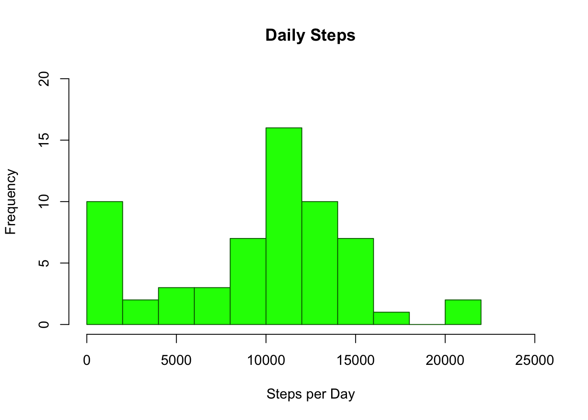
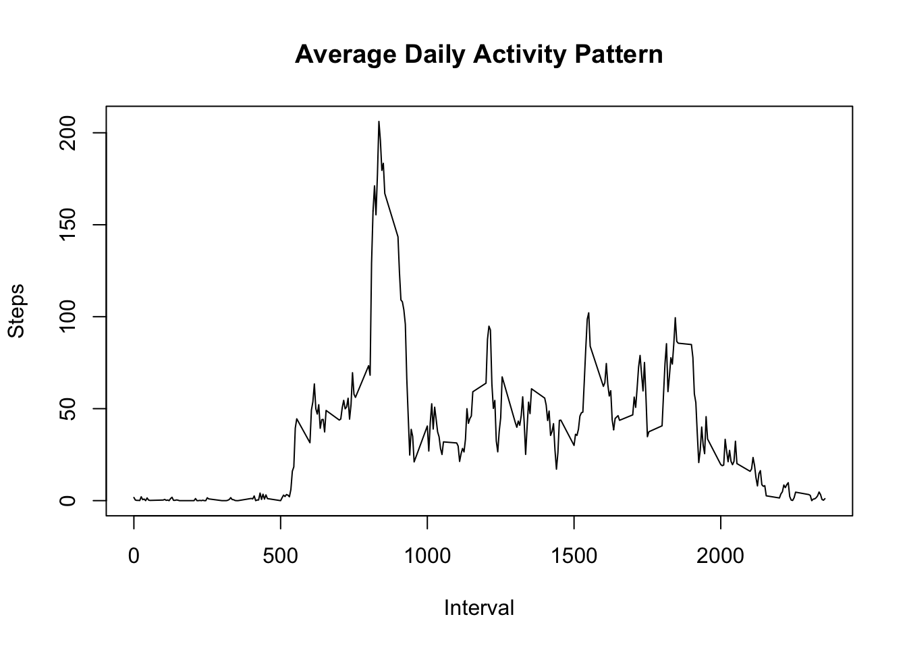
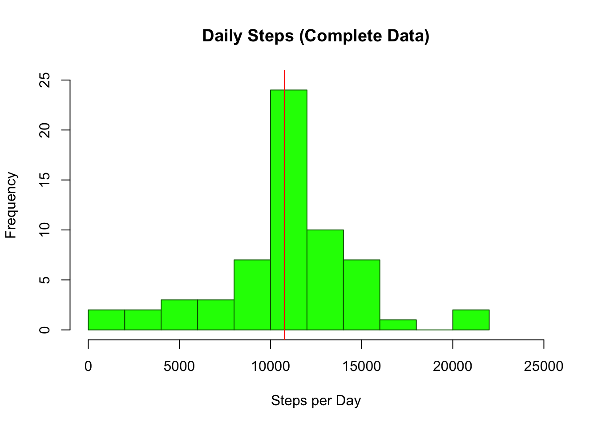
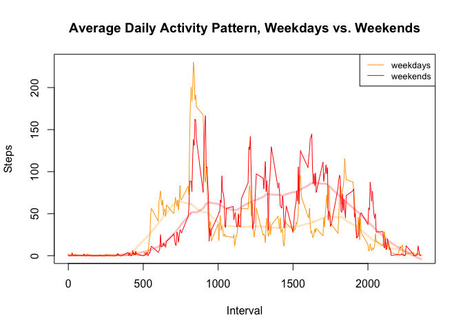

Project 1, Reprodicible Research
================
Jim McGuinness
5/7/2020

The assignment is broken down into multiple parts. The instructions for
each are reproduced below immediately followed by my proposed solution.

## Part 1: Loading and preprocessing the data

Show any code that is needed to …

1.  Load the data (i.e., `read.csv()`)
2.  Process/transform the data (if necessary) into a format suitable for
    your
analysis

#### Solution:

``` r
data.raw <- read.csv("activity.csv", colClasses=c("double", "Date", "integer"))
str(data.raw)
```

    ## 'data.frame':    17568 obs. of  3 variables:
    ##  $ steps   : num  NA NA NA NA NA NA NA NA NA NA ...
    ##  $ date    : Date, format: "2012-10-01" "2012-10-01" ...
    ##  $ interval: int  0 5 10 15 20 25 30 35 40 45 ...

Note: by specifying the `colClasses` parameter, transformation to `Date`
types is done while the data is being read in.

## Part 2: What is mean total number of steps taken per day?

For this part of the assignment, you can ignore the missing values in
the dataset.

1.  Calculate the total number of steps taken per day

#### Solution:

``` r
library(dplyr)
```

    ## 
    ## Attaching package: 'dplyr'

    ## The following objects are masked from 'package:stats':
    ## 
    ##     filter, lag

    ## The following objects are masked from 'package:base':
    ## 
    ##     intersect, setdiff, setequal, union

``` r
data.daily <-
    data.raw %>% 
    group_by(date) %>%
    summarize_at(vars(steps), list(steps = sum), na.rm=TRUE)
head(data.daily)
```

    ## # A tibble: 6 x 2
    ##   date       steps
    ##   <date>     <dbl>
    ## 1 2012-10-01     0
    ## 2 2012-10-02   126
    ## 3 2012-10-03 11352
    ## 4 2012-10-04 12116
    ## 5 2012-10-05 13294
    ## 6 2012-10-06 15420

2.  If you do not understand the difference between a histogram and a
    barplot, research the difference between them. Make a histogram of
    the total number of steps taken each day

#### Solution:

``` r
hist(data.daily$steps, breaks=8, xlim=c(0,25000), ylim=c(0,20),
     xlab="Steps per Day", main="Daily Steps", col="green", border="darkgreen")
```



3.  Calculate and report the mean and median of the total number of
    steps taken per day

#### Solution:

``` r
summary(data.daily$steps)
```

    ##    Min. 1st Qu.  Median    Mean 3rd Qu.    Max. 
    ##       0    6778   10395    9354   12811   21194

So the `mean()` of the steps taken is 9354.2295082 while the `median()`
is 1.039510^{4}.

## Part 3: What is the average daily activity pattern?

1.  Make a time series plot (i.e., `type="l"`) of the 5-minute interval
    (x-axis) and the average number of steps taken, averaged across all
    days (y-axis)

#### Solution:

``` r
data.interval <-
    data.raw %>% 
    group_by(interval) %>%
    summarize_at(vars(steps), list(steps.avg = mean), na.rm=TRUE)
head(data.interval)
```

    ## # A tibble: 6 x 2
    ##   interval steps.avg
    ##      <int>     <dbl>
    ## 1        0    1.72  
    ## 2        5    0.340 
    ## 3       10    0.132 
    ## 4       15    0.151 
    ## 5       20    0.0755
    ## 6       25    2.09

``` r
summary(data.interval$steps.avg)
```

    ##    Min. 1st Qu.  Median    Mean 3rd Qu.    Max. 
    ##   0.000   2.486  34.113  37.383  52.835 206.170

``` r
with(data.interval,
    plot(interval, steps.avg, type="l", xlab="Interval", ylab="Steps",
         main="Average Daily Activity Pattern"))
```



2.  Which 5-minute interval, on average across all the days in the
    dataset, contains the maximum number of
steps?

#### Solution:

``` r
interval.max <- data.interval[data.interval$steps.avg == max(data.interval$steps.avg),]
interval.max
```

    ## # A tibble: 1 x 2
    ##   interval steps.avg
    ##      <int>     <dbl>
    ## 1      835      206.

So the maximum average number of steps is 206.1698113 which is taken in
the interval 835.

## Part 4: Imputing missing values

Note that there are a number of days/intervals where there are missing
values (coded `NA`). The presence of missing days may introduce bias
into some calculations or summaries of the data.

1.  Calculate and report the total number of missing values in the
    dataset (i.e. the total number of rows with `NA`s)

#### Solution:

``` r
summary(complete.cases(data.raw))["FALSE"]
```

    ## FALSE 
    ##  2304

So there are 2304 `NA` values, all in the steps data.

2.  Devise a strategy for filling in all of the missing values in the
    dataset. The strategy does not need to be sophisticated. For
    example, you could use the mean/median for that day, or the mean for
    that 5-minute interval, etc.

#### Solution:

I elect to use the mean of the 5-minute interval values in filling in
the missing steps data.

3.  Create a new dataset that is equal to the original dataset but with
    the missing data filled in.

#### Solution:

``` r
data.complete <- 
    merge(data.raw, data.interval, by.x="interval", by.y="interval") %>% 
    mutate(steps.complete = ifelse(is.na(steps), steps.avg, steps)) %>%
    select(date, interval, steps.complete) %>%
    arrange(date, interval)

str(data.complete)
```

    ## 'data.frame':    17568 obs. of  3 variables:
    ##  $ date          : Date, format: "2012-10-01" "2012-10-01" ...
    ##  $ interval      : int  0 5 10 15 20 25 30 35 40 45 ...
    ##  $ steps.complete: num  1.717 0.3396 0.1321 0.1509 0.0755 ...

``` r
tail(data.complete)
```

    ##             date interval steps.complete
    ## 17563 2012-11-30     2330      2.6037736
    ## 17564 2012-11-30     2335      4.6981132
    ## 17565 2012-11-30     2340      3.3018868
    ## 17566 2012-11-30     2345      0.6415094
    ## 17567 2012-11-30     2350      0.2264151
    ## 17568 2012-11-30     2355      1.0754717

4.  Make a histogram of the total number of steps taken each day and
    Calculate and report the **mean** and **median** total number of
    steps taken per day. Do these values differ from the estimates from
    the first part of the assignment? What is the impact of imputing
    missing data on the estimates of the total daily number of steps?

#### Solution:

``` r
data.daily.complete <-
    data.complete %>% 
    group_by(date) %>%
    summarize_at(vars(steps.complete), list(steps.complete = sum))
head(data.daily.complete)
```

    ## # A tibble: 6 x 2
    ##   date       steps.complete
    ##   <date>              <dbl>
    ## 1 2012-10-01         10766.
    ## 2 2012-10-02           126 
    ## 3 2012-10-03         11352 
    ## 4 2012-10-04         12116 
    ## 5 2012-10-05         13294 
    ## 6 2012-10-06         15420

``` r
hist(data.daily.complete$steps.complete, breaks=8, xlim=c(0,25000), ylim=c(0,25),
     xlab="Steps per Day", main="Daily Steps (Complete Data)", col="green", border="darkgreen")
abline(v=mean(data.daily.complete$steps.complete), lty="dashed", col="blue")
abline(v=median(data.daily.complete$steps.complete), lty="solid", col="red")
```



The median and the mean are almost identical (about 10766), probably
because the NA-value days turned out to be the most prevelant and
therefore overshadowed actual values. Consequently the guesstimation of
missing values obscured actual values. I think the lesson learned is
that missing data should simply be excluded and not interpolated. On a
positive note, the data clusters very nicely around 10.7K steps a day.
But let’s check for differences vetween weekdays and weekends
…

## Part 5: Are there differences in activity patterns between weekdays and weekends?

For this part the `weekdays()` function may be of some help here. Use
the dataset with the filled-in missing values for this part.

1.  Create a new factor variable in the dataset with two levels –
    “weekday” and “weekend” indicating whether a given date is a
    weekday or weekend day.

#### Solution:

``` r
library(lubridate)
```

``` r
data.complete.wdays <-
    data.complete %>%
    mutate(day.type=ifelse(wday(data.complete$date) %in% c(1,7), "weekend", "weekday"))
head(data.complete.wdays)
```

    ##         date interval steps.complete day.type
    ## 1 2012-10-01        0      1.7169811  weekday
    ## 2 2012-10-01        5      0.3396226  weekday
    ## 3 2012-10-01       10      0.1320755  weekday
    ## 4 2012-10-01       15      0.1509434  weekday
    ## 5 2012-10-01       20      0.0754717  weekday
    ## 6 2012-10-01       25      2.0943396  weekday

2.  Make a panel plot containing a time series plot (i.e. `type="l"`) of
    the 5-minute interval (x-axis) and the average number of steps
    taken, averaged across all weekday days or weekend days (y-axis).
    See the README file in the GitHub repository to see an example of
    what this plot should look like using simulated data.

#### Solution:

``` r
data.interval.wdays <-
    data.complete.wdays %>%
    filter(day.type=="weekday") %>%
    group_by(interval) %>%
    summarize_at(vars(steps.complete), list(steps.complete = mean))
head(data.interval.wdays)
```

    ## # A tibble: 6 x 2
    ##   interval steps.complete
    ##      <int>          <dbl>
    ## 1        0         2.25  
    ## 2        5         0.445 
    ## 3       10         0.173 
    ## 4       15         0.198 
    ## 5       20         0.0990
    ## 6       25         1.59

``` r
data.interval.wkend <-
    data.complete.wdays %>%
    filter(day.type=="weekend") %>%
    group_by(interval) %>%
    summarize_at(vars(steps.complete), list(steps.complete = mean))
head(data.interval.wkend)
```

    ## # A tibble: 6 x 2
    ##   interval steps.complete
    ##      <int>          <dbl>
    ## 1        0        0.215  
    ## 2        5        0.0425 
    ## 3       10        0.0165 
    ## 4       15        0.0189 
    ## 5       20        0.00943
    ## 6       25        3.51

``` r
with(data.interval.wdays,
    plot(interval, steps.complete, type="l", col="orange", xlab="Interval", ylab="Steps",
         main="Average Daily Activity Pattern, Weekdays vs. Weekends"))
with(data.interval.wkend,
    lines(interval, steps.complete, type="l", col="red", xlab="", ylab="",
         main=""))
legend("topright", legend=c("weekdays", "weekends"),
       col=c("orange", "red"), lty=1, cex=0.8)
```



It appears that on weekdays, most of the walking occurs at 8:30 am and
pre-dinner, whereas on the weekends the walking is much more evenly
dispersed throughout the day.
